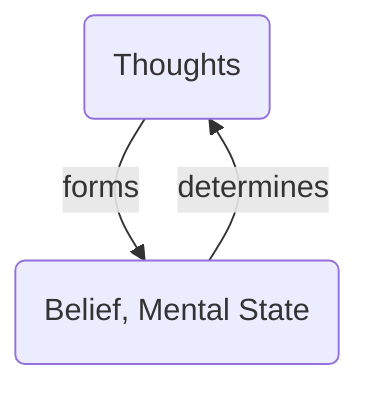

## Motivation

I think that the meaning for living needs to be intrinsic, rather than extrinsic.
I have faith in Jesus and that influences my perspective on life. Just because
one has faith does not mean that one has to be illogical. In fact, faith that is
not based on accurate knowledge is just delusion. There are two abstract things 
intrinsic to humans, yet, we have absolute control over. As opposed to what some
might perceive, I fair on the side of these two as outputs rather than inputs. 
What are they?

1. Our thoughts
2. Our imaginations

## How to read this document

First, this documentation are my meditations of the resources I found. I do not 
expect you to accept anything as absolute truth. I want you to think for yourself
and critically analyze my words. After observing the evidence, you can form beliefs
around them. Remember, beliefs without verifiable evidence is deception.

How can you make the most of this document? Get a pen and a paper and write down
the main points as you read. After hearing my thoughts, ask yourself: "Do I agree"
with what he is saying? If yes, why and if otherwise, why?" Then, write down your
conclusions after careful contemplations.

Do not offload this activity to an AI. **You should read and write.** But I guess
I cannot tell you what you can or cannot do. Shall we begin?

## Thoughts

### Musings on the theories

> Thoughts occur independently of the physical senses[^1].

I do not agree with this claim because senses can induce a particular thought. 
Maybe not all thoughts, but senses, when involved has the ability to induce a 
thought. For example, if I see someone attractive, I think of a compliment to 
give the person (99% of the time I end up not speaking). My physical sense of 
sight, induced a thought. I won't hold this theory an absolute truth. On the 
other hand, I think the researchers made this statement because some people can
get extreme and say that all my thoughts are induced by my physical senses. That
is also not true. It is ironic to see that an attempt to curb extreme definition
caused them to give another extreme definition. 

> When one thinks, it's rational and devoid of emotions. When one feels, it 
> involves direct emotional engagement.[^1]

I pondered on this thought for a while and I noticed something interesting. 
**Why is the word "motional" part of emotional?** So, I sought answers and I 
learned that emotions are internal motions seeking expression. Hmmm. Do I need to
express every emotion? I understand that our emotions stirs us to do something,
but must we always follow through with it? I do not think so. Honestly, if we did
everything we felt, some of us will be found breaking the law, trespassing people's
boundaries---that's unhealthy. If that is the case, then I would like to say that 
makes emotions intrinsic motivations for actions. They are signals. When there is a
signal, you need to pause and pay attention. On this wise, I disagree with the
proposition that when one thinks, it is devoid of emotions. I see from my understanding
of the root meaning of emotions that they are signals. Signals for thoughts. This 
is how I would have framed the above theory:

*Concious thoughts are signaled by emotions to make rational actions.*
*When one feels, it involves direct emotional engagement.*

That allowed me to come up with a good definition for a proactive and a reactive
person in the context of emotions and feelings. To a reactive person, emotions 
are signals for actions. To a proactive person, emotions are signals for thoughts
and the emotions themselves do not form part of the thoughts. Are you a proactive
person or a reactive person?

> Mine: Emotions communicate information to others. 

I agree with this proposition. I think it not only communicates information to
others, but to ourselves as well. Take note, people do not know how you feel. No
one can. They can only interprete your emotions based on your expressions. A squeezed
face with flaring teeth communicates to others that one is angry. As much as we
want to stay on the side of being rational beings, we underestimate the influence
of emotions in our interpretation of the world around us. In times where our 
thoughts cannot form words to express how we feel, allowing the expressions of 
emotions through other channels: face, body posture, etc---does a perfect job.

This is a little off topic, but I remember reading about mirror neurons a few 
years ago. They respond to actions we observe in others. For example, if I know
what it is like or have a perception of what happens when one touches a hot surface;
when I see someone else's touching the hot surface, I feel it. Though I did not
perform the action, my body experienced the emotions as if I actually did.

From these chain of thoughts, I believe **a good communicator is one that causes
you to feel their words.** It is a two-way street. Emotions signal actions and 
actions trigger emotions. Remember, emotions are signals for thoughts.

> Thoughts are the results of beliefs, mental states, or system of ideas held 
> by an individual or shared within a group[^1]. 

I agree. Thoughts are a consequence. But then, it's a cycle. Thoughts are also 
a cause and not just an effect. 

That means I have to pick one to start the cycle. And I'll pick thoughts. I need
to develop beliefs, mental states and a system of ideas fundamental to who I am.
The only way to form belief and mental states is through the door of thoughts.
If I tried to use a deterministic path to change something, it will not. I cannot
believe myself into changing the way I think. However, I can think to change
what I believe. Most of the time, the paths we choose in a cycle is not wrong,
the direction is.

> Thinking involves the use of language[^1].

I agree that thinking involves the use of language. The researchers spoke of a
syntax, not English or other human languages[^1]. The mind has it's own language.
There is a theory called the **Language of Thought Hypothesis**. It is states that
*"On the level of syntax, the mind has two types of representations: atomic and
compound representations"*[^1].

<!-- markdownlint-capture -->
<!-- markdownlint-disable -->
> **Atomic representations** are basic and **complex representations** are
> consituted either by other compound representations or by atomic representations.
> On the level of semantics, the semantic content or the meaning of the compound 
> representations should depend on the semantic contents of its constituents.
{: .prompt-info }
<!-- markdownlint-restore -->

I am learning how to give my mind shape---to make it my servant. I understand if 
you become disinterested at this point.

What I am realising is that the atomic representations are one's beliefs, one's
foundations. Surely, as humans, we have two extremities: **optimism** and **pessimism**.
The atomic representations of an optimist is positive only. Hence, their interpretation
of everything is based on the positives only. The pessimist follows the same path, but
chooses the worse-case scenarios at its atomic representations. To change one's
perspective is not to change their entire makeup and thoughts. If one can change
their atomic representations, then like a domino effect, other thoughts will be
updated.

> Associationism: The history of an organism's experience determines which thoughts
> the organism has and how these thoughts unfold[^1].

Yeah. I agree with this proposition. Experiences influence our thoughts. This is
something I can even leverage to rebuild the foundation of my thought processes.

### Mind Productivity

Under the theory of the *Language of Thought Hypothesis*, it defines a feature that
caught my attention. It reminded me of orthogonality in the concepts of
programming languages. 

**Productivity**: a system of representations is productive if it can generate 
an infinite number of unique representations based on a low number of atomic 
representations[^1].

In my own words, I can say that productivity of the mind is thinking from first
principles. What is the foundation? What are the basics? If I can understand and
think from the foundation, I can make my mind more productive. It is like a code
generator. Think functional programming. Instead of defining all the steps in a 
procedural language, with functional languages, one expresses what they want to do
in its basic form and the compiler generates the steps. I don't not need to know
the processes of the brain, my mind, my emotions, my soul and spirit. However, if
my atomic representations allows me to be more expressive, I can offload complexities
of a human being to the brain. Besides, it was designed for that.

### Types of Thinking

I will not exhaust all the types of thinking.

#### Entertainment

Before I decided to explore thoughts and imaginations, I thought entertainment had
something to do with leisure or pleasure, but the origin of the word and an old 
definition that is often pushed to the side is that **to entertain is to hold a thought**.
Entertainment is representing a thought without making up your mind as whether it
is true or false. This has caused me to see entertainment in a different light.
It is not about leisure or pleasure, but an education of the mind.

#### Judgement

Judgement is when you either affirm or deny a thought. People who are indecisive
entertain a lot of thoughts without making a judgement.

#### Falacy

This is a deceptive type of thinking that goes against the norms of correct reasoning[^1].
It is seen mostly in people who are ignorant. Let me give you a good example of a 
fallacy that the researcher gave: 

> If Othello is a bachelor, then he is a male.
> Othello is not a bachelor, then he is not a male.

It is logical, it is deductive reasoning, but as you can see, it is fundamentally flawed.
This is what is termed as a formal falacy. As you predicted, there is informal falacy.
The source of its flaw is in the context of the argument. Here is another example
the researchers gave:

> Feathers are light. What is light cannot be dark. 
> Therefore, feathers cannot be dark.

A culprit for informal falacy is ambiguity. I recall when I was reading *Aristotle's
Organon: Categories*, he mentioned something important. He said something along
the lines of, *"A logical statement should be based on a substance. A substance 
is a statement that has only one meaning. It leaves no room for ambiguity. It
ensures that the argument regardless of the context can have only one meaning."*
Like what we touched on concerning the compound representations of the mind: its
meaning is derived from its constituents. In the same way, the meaning of a
statement must be derived from the substance that makes it up. If we do not understand
the constituents of a statement, then the interpretation we make of it will be 
fundamentally flawed. That is when it becomes a falacy.

What do I mean? The statement, *"Feathers are light and what is light cannot be
dark"* is true. However, the conclusion, *"Feathers cannot be dark"* is flawed
because it ignores the meaning of the constituents. In this case, it is the word "light".
The context of the statement shows that "light" is referring to two different things.
That ignorance is what causes a deceptive conclusion called a falacy.

That reminds me. ChatGPT does that a lot. We called it a nice word: hallucination.
No, it is a falacy. The premises of AI are correct, but the conclusion cannot always
be trusted. I'm sure the engineers noticed and introduced "context". That is just 
by the way. Back to our main topic.

#### Problem Solving

Problem solving depends on two kinds of thinking: divergent and convergent thinking.
**Divergent thinking** aims at coming up with as many alternative solutions as possible.
On the other hand, **convergent thinking** tries to narrow down the range of 
alternatives to the most promising candidates.

The reason I brought this up because problem solving aims to reach a predefined goal
by overcoming obstacles. One chooses to achieve that by coming with as many alternative
solutions as possible, the other tries to narrow down to find the most promising solution.
I think it is naive to narrow down for solutions when solving problems as the first
instinct. It introduces a certain bias. I mean, if you knew the solution would work,
why seek to solve it in the first place? The premise and the immediate response of 
narrowing options is fundamentally flawed. However, it is not useless.

We can look at problem solving as a funnel. We begin by exploring all possible solutions,
as many as possible. Then, we test them and narrow down the ones that solves the problem
in ranking order. The top is divergent and the bottom converges. Now, you may say:
"But that is common sense!" Well, the last time you had to deal with an obstacle,
did you look at multiple options before choosing the path you decided on? Failure
to consider certain possibilities and fixating on a specific course of action
can become an obstacle. What if that is even already an obstacle for some of us?
We think only in one specific course of action. We are our own limitations.

In my research, I learned that there are fundamentally two ways to represent a solution:
algorithm and heuristics. An **algorithm** is a formal procedure in which each step 
is clearly defined. It guarantees success if applied correctly[^1]. **Heuristics**, 
on the other hand, are rough rules-of-thumb that tend to bring the thinker closer
to the solution but success is not guaranteed in every case even if followed 
correctly[^1].

That reminds me of a study I did a month ago about plans and strategies. I think
I can place them in the categories of an algorithm and heuristic. A plan is well-
thought out step-by-step procedure. If everything goes according to plan, it will
be a success. A strategy is more free-form and flexible. It examines possibilities
and adjusts to different courses of actions based on the events that occur to allow
you to be successful.

Surely, our mind follows these patterns. When we begin to understand how these
patterns work, we can influence them. It is no longer an obscure experience, but
participatory.

#### Deliberation

I liked this type of thinking as soon as I learned about it. Deliberation is a
practical form of thinking and it works like an internal simulation of possible
courses of action and assessing their value by considering the reasons for and
against them[^1]. The effectiveness of deliberation depends on exposure, knowledge and
experience.

#### Critical Thinking

To conclude the types of thought, we have critical thinking. Critical thinking 
is a form of thinking that is reasonable, reflective, and focused
on determining what to believe or how to act. It asserts whether the reasoning 
itself is sound, and the evidence it rests on is reliable.

John Dewey gives a good example to show who a critical thinker is:

> In an experiment of observing foam bubbles moving in a direction that is 
> contrary to one's initial expectations, the critical thinker tries to come up
> with various possible explanations of this behavior and then slightly modifies
> the original situation in order to determine which one is the right explanation.

Skepticism and flexibility is encouraged. There is one important caveat. It has
to be done by you. The fact that you arrived at the correct solution to a problem
by blindly following the steps of an algorithm does not qualify as critical thinking.
No learning was achieved. The same is true if the solution is presented to you 
in a sudden flash of insight and accepted straight away.

I won't derail to mention how improper use of AI is killing our critical thinking
abilities. Examine the evidence and arrive at your own conclusions.

Don't let anyone or anything think for you. Think for yourself: ask questions,
examine the evidence and make conclusions. Don't let anyone compel you to accept
any information, seek the evidence. If it is the truth, you'll get a similar result.

Critical thinking is not about the results. It is concerned about its reliability.
Reliability reinforces the formation of beliefs. True beliefs are backed by evidence.

### Mental States

In the definition of thoughts, we mentioned mental states. I will spare you a
deep dive of the theoritical aspects of mental states[^2]. I drew some conclusions
and made my definitions from the materials I engaged with.

**What is a mental state?** It is the state of the mind. The condition the mind is in.

Here is a breakdown of classifications I believe constitutes one's mental state:

1. **Belief:** What reality is to me.
2. **Perception:** My foundation of interpretating everything.
3. **Desire:** What I want.
4. **Intention:** The course of action I decide to follow, coupled with the 
  reasoning behind the choice.
5. **Emotion:** A signal that concerns my belief.
6. **Memory:** The experiences I have stored and can recall.

### The Mind Machine

We looked at all the theory, explored different ideas and came up with my own,
so that we can have a clear understanding of our thoughts. Just to refresh our minds
on some major conclusions:

- Physical senses have the ability to induce thoughts.
- Logic alone is not sufficient for the character of thoughts.
- Emotions are internal motions seeking expressions.
- Emotions are signals for thoughts.
  - You are reactive when you act based on the emotions you feel.
  - You are proactive when you let the emotions lead you to think before acting.
- Expressing emotions communicates information to others.
- Feeling emotions communicates information to one's self.
- A good communicator is one that causes you to feel their words.
- Emotions signal actions and actions trigger emotions.
- Build orthogonal atomic representations for a productive mind.
- Thoughts and experiences are the formative pathway in the mind machine.
- Beliefs and mental states are the deterministic pathway in the mind machine.
- To entertain is to hold a thought.
- To judge is to affirm or deny a thought.
- Atomic representations of thoughts needs to be substance (have only one meaning)
  to avoid deceiving one's self.
- The processing of thoughts either parses through an algorithm or a heuristic.
- A plan is to an algorithm; as a strategy is to a heuristic.
- To deliberate is to internally simulate a course of action and assess it's value
  by considering reasons for or against them.
- Exposure, knowledge and experiences are important for an effective functioning of
  the mind machine.
- Think critically always. Make deductions by examining reliable evidence.
- Critical thinking concerns itself with the reliability of thoughts. That 
  reliability reinforces the formation of beliefs.

In building the mind machine, we need to be aware that the process is cyclical,
not linear.

{: .light }
{: .dark }
_The Mind Machine_

## Why All This?

At the end of the day, I do not want my mental state to be something that happens
to me, but something I conciously influence. If our life experiences is reflective
of our mind machine (mental state), I want to live, not to be lived.

## Imaginations

We will delve into imaginations in a later document.

---

## Attribution

- [Cover Photo by Engin Akyurt](https://www.pexels.com/photo/person-sitting-in-front-of-body-of-water-2174625/)

## References 

[^1]: [Thought - Wikipedia](https://en.wikipedia.org/wiki/Thought)
[^2]: [Mental state - Wikipedia](https://en.wikipedia.org/wiki/Mental_state)
